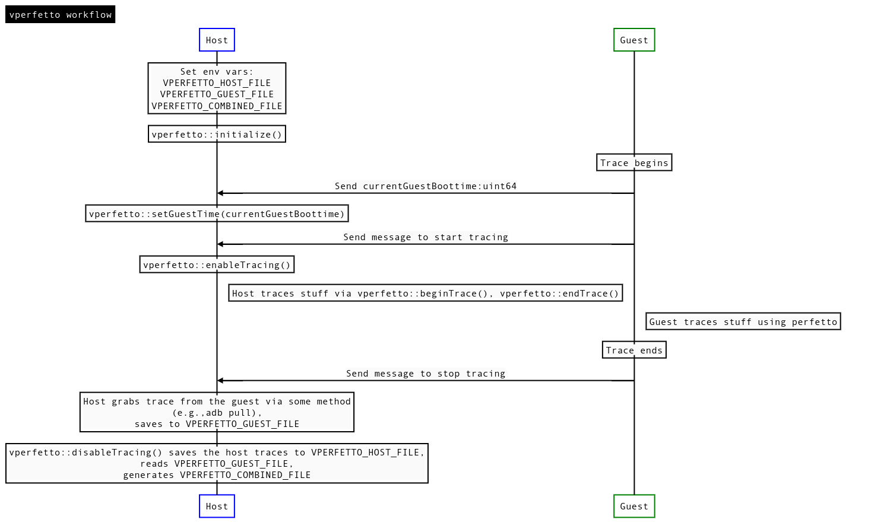

# Build

    mkdir build
    cd build
    cmake . ../
    make

generates `libvperfetto.so`

# How to use

Link `libvperfetto.so`

Workflow (namespace vperfetto)

    
# Min option

If you only need track events and counters, set `OPTION_USE_PERFETTO_SDK` to
`FALSE` in CMakeLists.txt; resulting binary is smaller.

# Known issues

Trace counters not yet supported in the SDK variant.
